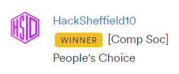

# Clash Royale Deck Analyzer  

🏆 **HackSheffield 10 – People’s Choice Award**  
**Link to the Devpost:** [Website](https://devpost.com/software/clash-royale-deck-simulator)



**Clash Royale Deck Analyzer** is a Python-based application that helps players analyze and optimize their Clash Royale decks. The app provides insights into **deck performance**, **archetypes**, and **key statistics** to enhance strategy and improve gameplay. Players can input their decks through a **graphical interface**, **deck link**, or **manual entry** for analysis.

Originally developed during **HackSheffield 10**, the project received the **People’s Choice Award**, earning the highest number of community votes. This repository contains a cleaned-up version of the original hackathon-winning submission.

## Features
- **Deck Input Options**: Input decks using a graphical builder, paste a deck link, or manually type card names.  
- **Detailed Analysis**: Displays stats such as 4-card cycle, average elixir cost, and deck archetype, powered by data from the top 100 global players.  
- **Visual Insights**: Generates pie charts and graphs to highlight deck strengths and weaknesses.  
- **Strategic Suggestions**: Offers tailored recommendations to help optimize deck performance.  

## Requirements
- **Python 3.7 or higher**  
- **Dependencies**: Listed in `requirements.txt`  

## Setup

1. Clone the repository:
    ```bash
    git clone https://github.com/Shadowblades746/Clash-Royale-Deck-Analyzer.git
    ```

2. Install dependencies:
    ```bash
    pip install -r requirements.txt
    ```

3. Run the application:
    ```bash
    python main.py
    ```

## Demo Video
🎥 Watch the project showcase on  [YouTube](https://youtu.be/4VCsr4iWfVc).
